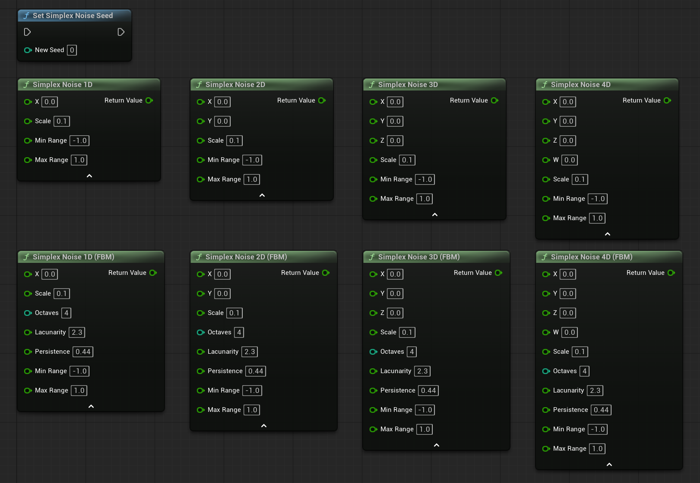
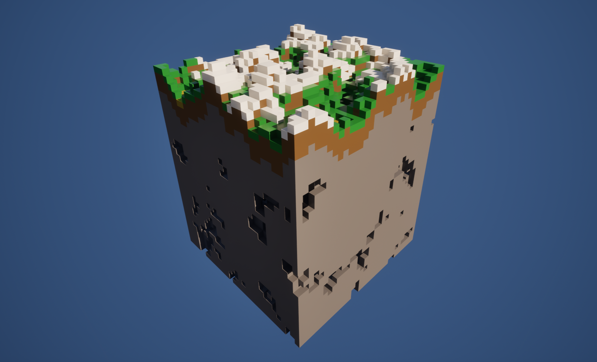

# Simplex Noise Plugin

Simplex Noise plugin for Unreal Engine 5 that provides 1D - 4D noise and Fractional Brownian Motion in Blueprints and C++, with double precision throughout and a SIMD-accelerated batch API for high-performance workloads.

Originally created by **DevDad** (Afan Olovcic). Extended by **Solessfir**.

---

## Installation

Get `SimplexNoise.zip` from the [releases](https://github.com/Solessfir/SimplexNoise/releases) and extract it into your project's `Plugins` folder.

---

## Features

- **Double precision** throughout - all Blueprint and C++ functions use `double`, not `float`
- **1D, 2D, 3D, and 4D** Simplex Noise
- **Fractional Brownian Motion (FBM)** variants for 1D, 2D, 3D, and 4D
- **Per-thread seeding** - each thread keeps its own permutation table, safe for multithreaded generation
- **C++ batch API** - evaluate thousands of points at once, significantly faster than looping over scalar functions
- **SIMD acceleration** - 2D batch functions use AVX + FMA on supported x86-64 hardware (Clang), processing 4 samples per clock cycle in the floating-point stage. Automatically falls back to scalar on unsupported platforms
- **Blueprint-native** - all scalar functions are Blueprint Pure nodes with sensible defaults and clean category organisation
- **Biome Diorama example** - a fully documented tutorial `AActor` that builds a voxel biome scene with caves, beaches, and snow peaks to showcase the noise functions in practice

---

## Screenshots




---

## Blueprint Functions

All functions are found under the **SimplexNoise** and **Simplex Noise | FBM** categories in the Blueprint function library.

Every function accepts a `Scale` parameter (zoom level - higher = larger features) and remaps its output to a `[MinRange, MaxRange]` of your choice. The default range is `[-1, 1]`.

### Noise

| Function | Description |
|---|---|
| `SimplexNoise1D` | Noise along a single axis. Useful for animating a single value over time. |
| `SimplexNoise2D` | Noise on a flat plane. The workhorse for heightmaps and surface textures. |
| `SimplexNoise3D` | Volumetric noise. Useful for clouds, fog density, and 3D terrain carving. |
| `SimplexNoise4D` | 4D noise. Use W as a time axis to animate 3D noise without visible looping or sliding. |

### Fractional Brownian Motion (FBM)

FBM stacks multiple layers (octaves) of noise on top of each other. Each layer is finer and quieter than the previous one, building up the kind of complex, natural-looking detail you see in real terrain and clouds.

| Parameter | What it does |
|---|---|
| `Octaves` | Number of layers to stack. More = more fine detail. 4 is a good general default. |
| `Lacunarity` | How much finer each layer is compared to the previous. Typically `2.0`. |
| `Persistence` | How much quieter each layer is compared to the previous. Typically `0.5`. Lower = smoother result. |

| Function | Description |
|---|---|
| `SimplexNoise1D_FBM` | FBM variant of 1D noise. |
| `SimplexNoise2D_FBM` | FBM variant of 2D noise. Best choice for terrain heightmaps. |
| `SimplexNoise3D_FBM` | FBM variant of 3D noise. Best choice for cave carving and volumetric effects. |
| `SimplexNoise4D_FBM` | FBM variant of 4D noise. Animated 3D volumes without repetition. |

### Seed

```cpp
// Blueprint
SetSimplexNoiseSeed(42);

// C++
USimplexNoiseBlueprintFunctionLibrary::SetSimplexNoiseSeed(42);
```

Re-seeds the permutation table for the calling thread using a Fisher-Yates shuffle. Call this on every thread that needs a non-default seed. The default permutation is Ken Perlin's original 1983 table.

---

## C++ Batch API

For high-performance use cases (terrain generation, texture baking, large point clouds), the batch functions avoid the per-call overhead of the Blueprint nodes and enable SIMD processing.

```cpp
// Evaluate 2D noise for an entire grid in one call
TArray<double> InputX;
TArray<double> InputY;
TArray<double> Results;

InputX.SetNum(Width * Height);
InputY.SetNum(Width * Height);
Results.SetNum(Width * Height);

// ... fill InputX and InputY with your world-space coordinates ...

USimplexNoiseBlueprintFunctionLibrary::SimplexNoise2D_Batch(
    InputX,    // X positions
    InputY,    // Y positions
    0.07,      // Scale
    Results,   // Output written here
    0.0,       // MinRange
    1.0        // MaxRange
);
```

**Available batch functions:**

| Function | Notes |
|---|---|
| `SimplexNoise1D_Batch` | Scalar loop. |
| `SimplexNoise2D_Batch` | AVX + FMA SIMD on Clang x86-64, scalar fallback elsewhere. |
| `SimplexNoise3D_Batch` | Scalar loop. |
| `SimplexNoise4D_Batch` | Scalar loop. |
| `SimplexNoise2D_FBM_Batch` | Calls the 2D SIMD kernel once per octave. |

AVX + FMA support is checked at runtime on the first call and cached, so there is no repeated overhead. The `__attribute__((target("avx,fma")))` attribute on the SIMD kernel means AVX instructions are isolated to that one function - no project-wide `-mavx` flag is required.

---

## Example Content

### `ExampleDioramaActor`

A tutorial `AActor` that procedurally builds a small voxel biome scene made of 1 × 1 × 1 m cubes using this plugin. Intended as a starting point for voxel terrain or as a live showcase of what the noise functions can produce together.



**How to use:**
1. Place a `ExampleDioramaActor` in your level
2. Populate the `BlockTypes` array with your cube meshes - one entry per block appearance (Grass, Dirt, Stone, Sand, Snow, Cave Rock)
3. Adjust `DioramaSize`, `NoiseSeed`, and the noise parameters in the Details panel
4. Click **Generate Diorama** in the Details panel - click **Clear Diorama** to remove it and start over

**What each noise function does inside the diorama:**

| Noise call | Role in the scene |
|---|---|
| `SimplexNoise2D_FBM` | Heightmap - one sample per column decides how tall that column of blocks is |
| `SimplexNoise2D` (offset) | Biome blend - a second low-frequency map shifts surface blocks between grass, sand, and snow |
| `SimplexNoise3D_FBM` | Cave carving - voxels below the surface are removed wherever this value exceeds a threshold |

All blocks of the same type are batched into a single `UInstancedStaticMeshComponent`, so a full 32 × 32 × 24 diorama (~8 000 visible blocks) renders in only as many draw calls as there are distinct block types.

Exposed parameters to experiment with:

| Parameter | Effect |
|---|---|
| `NoiseSeed` | Completely changes the landscape while keeping the same shape settings |
| `TerrainScale` | Zoom level of the hills. Lower = broader, more open terrain |
| `TerrainOctaves` | More octaves = more small bumps and surface roughness |
| `CaveThreshold` | Lower = larger, more frequent caves |
| `CaveCeilingZ` | How deep caves are allowed to reach toward the surface |
| `SeaLevel` / `BeachWidth` | Controls where sand appears near low-lying terrain |
| `SnowAltitude` | How high terrain needs to be before snow appears |

---

## Credits and References

This algorithm was originally designed by **Ken Perlin**.
This implementation is adapted from the reference code by **Stefan Gustavson**, modified for Unreal Engine 5.

If you need higher performance or more noise types (Cellular, Domain Warping, etc.), see:
[UnrealFastNoise2](https://github.com/DoubleDeez/UnrealFastNoise2)